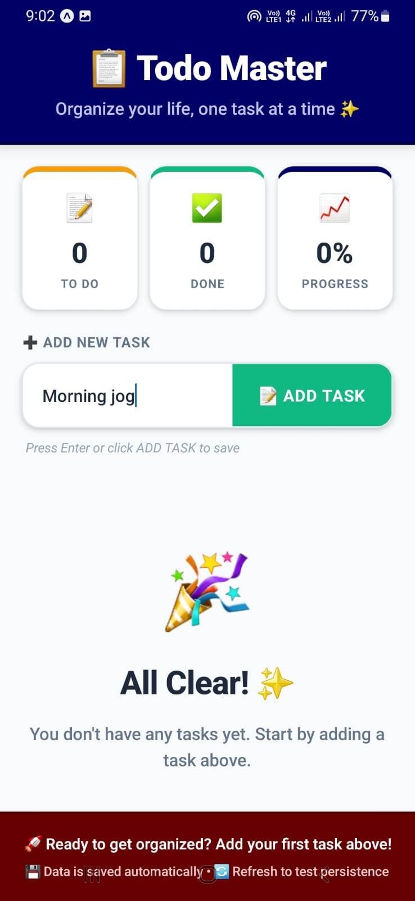
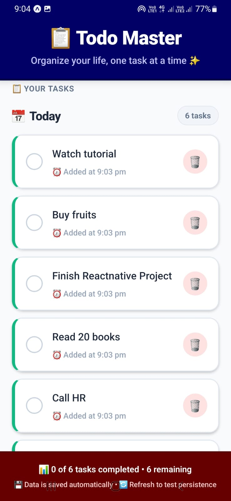
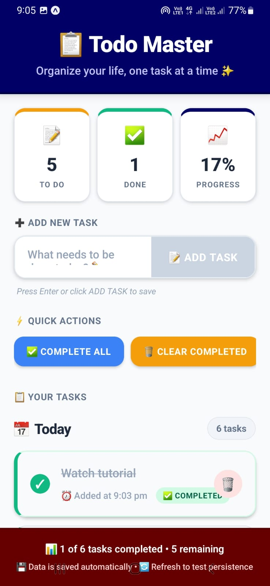

# 📱 Todo Master - React Native Todo List App

## 🚀 Project Overview

A **beautiful, feature-rich, and intuitive** todo list application built with React Native. Organize your life with smart task management, automatic saving, and powerful productivity tools. Perfect for daily task tracking with a focus on user experience and design.

---

## 📸 App Screenshots

### **🏠 Home Screen - Empty State**

*Clean welcome screen when no tasks are added yet*

### **📝 Adding a Task**

*Input field for adding new tasks with emoji suggestions*

### **✅ Task Lists**

*Tasks displayed with checkboxes and timestamps*

### **🎨 Completed Tasks View**

*Visual distinction for completed tasks with badges*

### **⚠️ Delete Confirmation**

*Safety confirmation dialog before deleting tasks*

---

## ✨ Features

### 🎯 **Core Functionality**
| Feature | Status | Description |
|---------|--------|-------------|
| ✅ **Task Management** | Complete | Add, edit, delete tasks |
| ✅ **Task Completion** | Complete | Mark tasks as complete/incomplete |
| ✅ **Automatic Saving** | Complete | AsyncStorage for persistence |
| ✅ **Data Export** | Complete | Export tasks for backup |
| ✅ **Bulk Actions** | Complete | Complete all, clear completed, delete all |
| ✅ **Smart Grouping** | Complete | Tasks grouped by date (Today, Yesterday) |
| ✅ **Statistics** | Complete | Real-time progress tracking |
| ✅ **Responsive Design** | Complete | Works on all mobile devices |

### 📊 **Smart Organization**
- **Date-based Grouping**: Tasks automatically categorized as Today/Yesterday/Other dates
- **Visual Progress**: Color-coded statistics and progress bars
- **Quick Overview**: Pending vs completed tasks at a glance
- **Timestamp Tracking**: Each task shows creation time

### ⚡ **Productivity Features**
- **One-tap Actions**: Quick complete, delete, and clear operations
- **Smart Sorting**: Newest tasks appear first
- **Bulk Operations**: Manage multiple tasks simultaneously
- **Export Functionality**: Backup your tasks data
- **Confirmation Dialogs**: Prevent accidental data loss

### 🛡️ **Data Safety**
- **Auto-save**: Changes saved automatically
- **Double Confirmation**: For destructive actions
- **Local Storage**: All data stays on device
- **Error Handling**: Graceful error messages and recovery

---

## 🛠️ Technology Stack

### **Frontend**
- **Framework**: React Native 0.70+
- **Language**: JavaScript (ES6+)
- **Styling**: React Native StyleSheet
- **Icons**: Native emoji support

### **Storage & Persistence**
- **AsyncStorage**: Local data persistence
- **JSON Serialization**: Task data formatting
- **Error Handling**: Robust storage operations

### **Development Tools**
- **Expo Go**: For testing and development
- **VS Code**: Primary code editor
- **GitHub Desktop**: Version control
- **React Native Debugger**: Debugging tools

### **Platform Support**
- **iOS**: 14.0+ (Tested with Expo Go)
- **Android**: 10.0+ (Tested with Expo Go)
- **Screen Sizes**: All mobile screen sizes

---

## 📦 Installation & Setup

### **Prerequisites**

Make sure you have these installed:

- ☑️ **Node.js** (v16 or newer)
- ☑️ **npm** or **yarn** package manager
- ☑️ **Expo Go App** on your mobile device
- ☑️ **Git** (for version control)
- ☑️ **VS Code** (recommended editor)

### **Step 1: Clone the Project**

```bash
# Clone the repository
git clone <your-repo-url>
cd SIMPLETODOAPP

# Install dependencies
npm install
# or
yarn install
```

### **Step 2: Run the App**

```bash
# Start the development server
npx expo start

# Then scan the QR code with:
# - iOS: Camera app (with Expo Go installed)
# - Android: Expo Go app
```

### **Step 3: Connect Your Device**

1. **Install Expo Go** on your mobile device
2. **Connect to same WiFi network** as your computer
3. **Scan QR code** from terminal or Expo Dev Tools
4. **Enable Live Reload** in Expo Go settings for instant updates

---

## 📁 Project Structure

```
SIMPLETODOAPP/
│
├── 📄 App.js                    # Main application component (14.5KB)
├── 📄 index.js                 # App entry point
├── 📄 app.json                 # Expo configuration
├── 📄 package.json             # Dependencies and scripts
├── 📄 package-lock.json        # Locked dependencies
├── 📄 README.md                # This documentation
│
├── 📂 .expo/                   # Expo development files
│   └── (Expo cache and config)
│
├── 📂 assets/                  # App icons and splash screens
│   ├── 📄 adaptive-icon.png    # Android adaptive icon
│   ├── 📄 favicon.png          # Web favicon
│   ├── 📄 icon.png             # App icon
│   └── 📄 splash-icon.png      # Splash screen icon
│
├── 📂 screenshots/             # App screenshots
│   ├── 📄 home-empty.png       # Empty home screen
│   ├── 📄 add-task.png         # Adding task screen
│   ├── 📄 task-list.png        # Task list view
│   ├── 📄 completed-tasks.png  # Completed tasks view
│   └── 📄 delete-confirm.png   # Delete confirmation
│
├── 📂 node_modules/            # Dependencies (auto-generated)
│   └── (All npm packages)
│
├── 📄 .gitattributes           # Git file attributes
└── 📄 .gitignore              # Git ignored files
```

---

## 📱 How to Use

### **👤 Getting Started**

1. **Launch the app** through Expo Go
2. **See empty state** with helpful tips (as shown in screenshots)
3. **Start adding tasks** using the input field

### **➕ Adding Tasks** (Refer to `add-task.png`)

1. **Type** your task in the input field at the top
2. **Press** "ADD TASK" or hit Enter
3. **Watch** it appear in your task list with timestamp

### **✅ Managing Tasks** (Refer to `task-list.png`)

- **Complete Task**: Tap the circle checkbox next to any task
- **Delete Task**: Tap the 🗑️ icon (requires confirmation - see `delete-confirm.png`)
- **View Details**: See when each task was created
- **Group View**: Tasks organized by date automatically

### **⚡ Quick Actions**

- **✅ COMPLETE ALL**: Marks all tasks as complete
- **🗑️ CLEAR COMPLETED**: Removes all completed tasks
- **📤 EXPORT TASKS**: Prepares task data for backup
- **🚫 DELETE ALL**: Removes all tasks (double confirmation shown)

### **📊 Statistics**

- **Pending**: Number of incomplete tasks
- **Completed**: Number of finished tasks
- **Progress**: Percentage of tasks completed
- **Date Groups**: Today, Yesterday, and older dates

### **🚪 Data Management**

- **Auto-save**: All changes saved automatically
- **Persistence**: Data survives app restarts
- **Export**: Backup your tasks when needed
- **Reset**: Clear all data with delete all

---

## 🎨 Design System

### **Color Palette**
| Color | Hex | Usage |
|-------|-----|-------|
| Primary | `#000066` | Header, main actions |
| Success | `#10B981` | Completed tasks, add button |
| Warning | `#F59E0B` | Pending stats, warnings |
| Danger | `#EF4444` | Delete actions, errors |
| Background | `#F8FAFC` | App background |
| Text Primary | `#1E293B` | Main text |
| Text Secondary | `#64748B` | Subtle text |

### **Typography**
- **Headers**: Large, bold fonts for sections
- **Body**: Medium weight for readability
- **Labels**: Small caps for statistics
- **Emojis**: Used for visual cues and icons

### **UI Components**
- **Cards**: Subtle shadows and rounded corners
- **Buttons**: Clear visual hierarchy
- **Inputs**: Clean design with placeholders
- **Lists**: Organized with clear separators
- **Badges**: For status and counts

### **Animations & Feedback**
- **Visual Feedback**: Button states and interactions
- **Smooth Transitions**: Between states
- **Loading States**: During data operations
- **Error Messages**: Clear and helpful

---

## 🔧 Technical Implementation

### **State Management**
```javascript
// Main state structure
const [tasks, setTasks] = useState([]);          // All tasks
const [task, setTask] = useState('');           // Current input
const [loading, setLoading] = useState(true);   // Loading state

// Task object structure
{
  id: String,           // Unique identifier (timestamp)
  text: String,         // Task description
  completed: Boolean,   // Completion status
  createdAt: String,    // Time created (HH:MM)
  createdDate: String   // Date created (MM/DD/YYYY)
}
```

### **Storage Implementation**
```javascript
// AsyncStorage operations
const STORAGE_KEY = '@simple_todo_app_tasks';

// Save tasks automatically
useEffect(() => {
  if (!loading) {
    saveTasksToStorage();
  }
}, [tasks, loading]);

// Load on app start
useEffect(() => {
  loadTasksFromStorage();
}, []);
```

### **Data Flow**
1. User interacts with UI
2. State updates in React
3. useEffect triggers save to AsyncStorage
4. Data persists between app sessions
5. On restart, data loads from AsyncStorage

---

## 🧪 Testing

### **Testing with Expo Go**

```bash
# Start the development server
npx expo start

# Scan QR code with:
# - iOS: Camera app → Open in Expo Go
# - Android: Expo Go app → Scan QR code
```

### **Test Checklist**

**Core Functionality:**
- [ ] Add new tasks (as shown in `add-task.png`)
- [ ] Mark tasks as complete (see `completed-tasks.png`)
- [ ] Delete individual tasks (with confirmation - `delete-confirm.png`)
- [ ] Clear completed tasks
- [ ] Complete all tasks
- [ ] Delete all tasks

**Data Persistence:**
- [ ] App restart (data persists)
- [ ] Force close and reopen
- [ ] Background/foreground transitions

**User Experience:**
- [ ] Different screen sizes
- [ ] Keyboard handling
- [ ] Touch interactions
- [ ] Error scenarios
- [ ] Loading states

---

## 🚀 Development Workflow

### **Development Commands**

```bash
# Start development server
npx expo start

# Clear cache and restart
npx expo start --clear

# Run on specific platform
npx expo start --android
npx expo start --ios
npx expo start --web

# Build for production
npx expo build:android
npx expo build:ios

# Eject from Expo (if needed)
npx expo eject
```

### **Hot Reload & Live Updates**
- **Save changes** in VS Code
- **App updates automatically** on your device
- **No need to restart** the development server
- **Instant feedback** while coding

---

## 📱 Platform-Specific Notes

### **iOS Development**
- **Test on**: iPhone simulators or physical devices
- **Requirements**: macOS for iOS builds
- **Permissions**: None required for basic functionality

### **Android Development**
- **Test on**: Android emulator or physical devices
- **Requirements**: Android Studio for emulators
- **Permissions**: Storage permission for AsyncStorage

### **Expo Go Limitations**
- **No Background Tasks**: App must be in foreground
- **Limited Native Modules**: Some APIs require ejecting
- **Development Only**: Not for production distribution

---

## 🔄 Future Enhancements

### **Planned Features**
1. **Task Editing**: Edit existing tasks
2. **Task Categories**: Organize by categories/tags
3. **Due Dates**: Add deadlines and reminders
4. **Search Functionality**: Find tasks quickly
5. **Sorting Options**: Sort by date, name, completion

### **Technical Improvements**
1. **State Management**: Context API for global state
2. **Component Separation**: Split App.js into smaller components
3. **Type Safety**: Add PropTypes or TypeScript
4. **Testing Suite**: Add Jest and React Testing Library

---

## 🐛 Troubleshooting

### **Common Issues**

**App won't start:**
```bash
# Clear all caches
npx expo start --clear
rm -rf node_modules
npm install
```

**Expo Go connection issues:**
- Ensure same WiFi network
- Check firewall settings
- Try `npx expo start --tunnel`
- Restart Expo Go app

**AsyncStorage errors:**
- Check storage permissions
- Verify AsyncStorage installation
- Handle storage full scenarios

### **Debugging Tips**

1. **Check Console**: Expo Dev Tools console
2. **Inspect Storage**: Check AsyncStorage contents
3. **Test on Device**: Physical device testing
4. **Simplify**: Reduce to minimal reproducible case

---

## 📚 Learning Resources

### **React Native Fundamentals**
- [React Native Official Docs](https://reactnative.dev/docs/getting-started)
- [Expo Documentation](https://docs.expo.dev/)
- [React Hooks Guide](https://reactjs.org/docs/hooks-intro.html)

### **Project References**
- [Expo Go Testing](https://expo.dev/client)
- [GitHub Desktop Guide](https://docs.github.com/en/desktop)
- [VS Code for React Native](https://code.visualstudio.com/docs/react/react-native)

---

## 📄 License & Attribution

### **License**
This project is available under the **MIT License**.

### **Educational Purpose**
Created as a **learning project** to demonstrate:
- React Native development
- Mobile app design principles
- Local data persistence
- State management patterns
- User experience best practices

### **Credits**
- **Author**: Tharmeekan Senthurselvan
- **Framework**: React Native by Facebook
- **Tools**: Expo, VS Code, GitHub Desktop
- **Icons**: Native emoji characters

---

## 🎉 Project Status & Summary

### **Current Status**
- ✅ **Core Features**: Complete and tested
- ✅ **UI/UX Design**: Polished and responsive
- ✅ **Data Persistence**: Fully functional
- ✅ **Error Handling**: Robust implementation
- ⚡ **Performance**: Optimized for mobile
- 📱 **Platform Support**: iOS and Android

### **Key Achievements**
1. **Complete Todo System**: All essential features implemented
2. **Beautiful Design**: Professional and user-friendly interface (documented with screenshots)
3. **Reliable Storage**: Data persists between sessions
4. **Intuitive UX**: Easy to use with clear feedback
5. **Single File Architecture**: All logic in one maintainable file

### **Visual Documentation**
The app includes comprehensive visual documentation through screenshots showing:
- All major user interfaces
- Different app states
- Interactive elements
- Confirmation dialogs

### **Ready For**
- 🎓 **Learning**: Study React Native patterns
- 🚀 **Extension**: Add more features
- 📱 **Production**: With additional polish
- 💼 **Portfolio**: Showcase React Native skills with visual proof

---

## 🌟 Final Notes

**Project Highlights:**
- 🏗️ **Single File Architecture**: All code in App.js for simplicity
- 🎨 **Beautiful Design**: Professional mobile interface (documented with screenshots)
- 💾 **Data Persistence**: Reliable AsyncStorage implementation
- 📱 **Cross-platform**: Works on iOS and Android via Expo Go
- 🔧 **Easy to Run**: Simple `npx expo start` to launch

**To Run the Project:**
```bash
# Clone and install
git clone <repository-url>
cd SIMPLETODOAPP
npm install

# Start the app
npx expo start
# Scan QR code with Expo Go app
```

**Development Workflow:**
1. Make changes in `App.js`
2. Save the file
3. App automatically updates on your device
4. Test immediately with Expo Go

**Happy Coding!** 💻🚀

